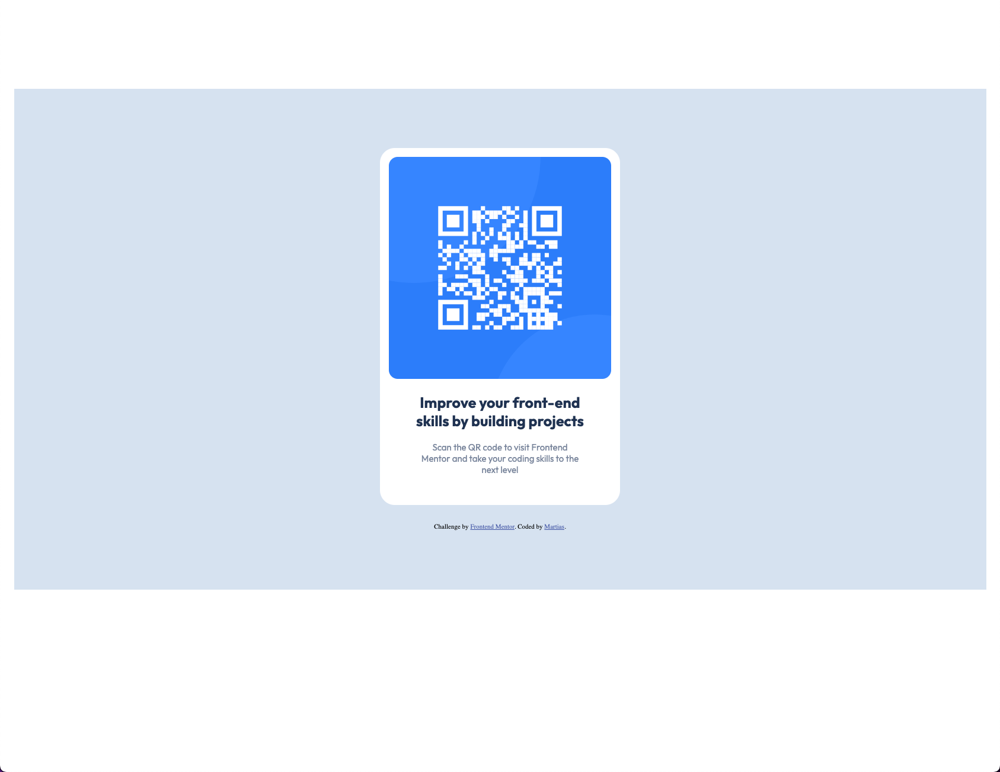

# Frontend Mentor - QR code component solution

This is a solution to the [QR code component challenge on Frontend Mentor](https://www.frontendmentor.io/challenges/qr-code-component-iux_sIO_H). Frontend Mentor challenges help you improve your coding skills by building realistic projects.

## Table of contents

- [Overview](#overview)

  - [Screenshot](#screenshot)

- [My process](#my-process)
  - [Built with](#built-with)
  - [What I learned](#what-i-learned)
  - [Continued development](#continued-development)
  - [Useful resources](#useful-resources)

## Overview

### Screenshot



## My process

### Built with

- Semantic HTML5 markup
- CSS custom properties

### What I learned

I used media queries for a responsive look on mobile devices. Styling the QR card to resemble the assignment as much as possible.

To see how you can add code snippets, see below:

```css
@media (max-width: 376px) {
        .container {
          ...
        }
```

### Continued development

Perfect the mobile-first technique. Improve your sense of website design and layout.

### Useful resources

- [Example resource 1](https://www.udemy.com/user/4b4368a3-b5c8-4529-aa65-2056ec31f37e/) - Their video courses helped me immerse myself in the basics of HTML and CSS.
- [Example resource 2](https://www.udemy.com/user/jonasschmedtmann/) - Their video courses helped me immerse myself in the basics of HTML and CSS.
